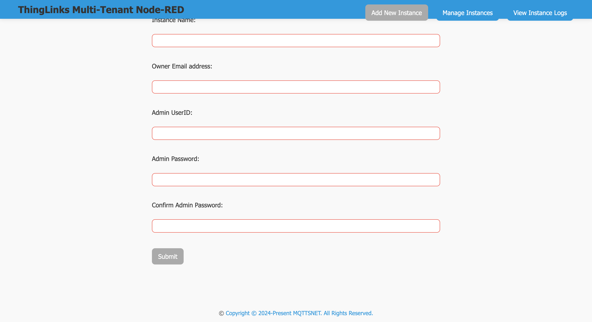
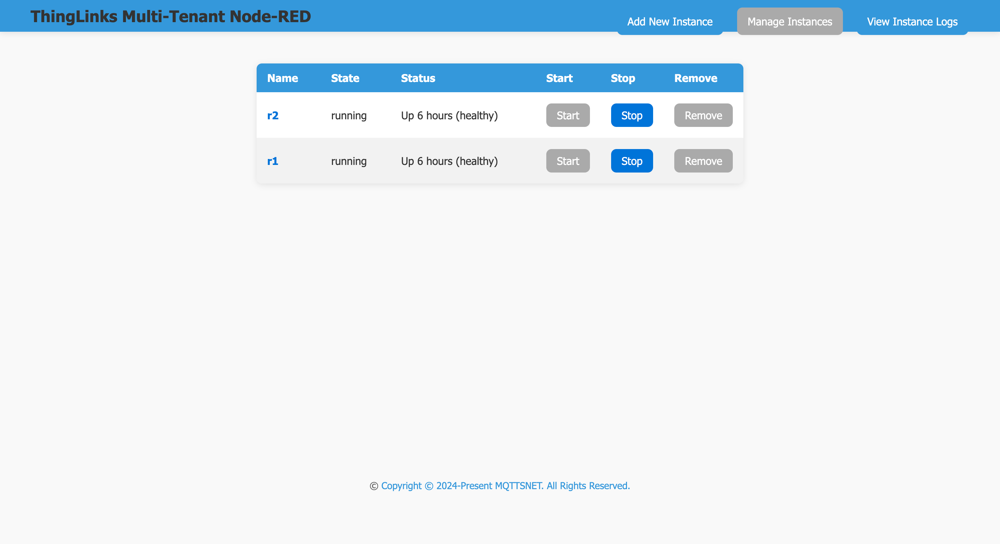
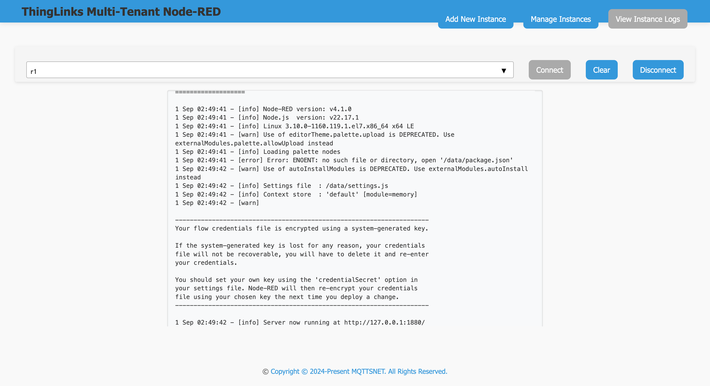

<div align="center">

[](http://www.mqttsnet.com)

</div>

# ThingLinks Multi Tenant Node-RED Docker Compose

## Deprecated 

A collection of Docker container that will implement a Multi Tenant Node-RED environment.


## Download

```
$ git clone --recurse-submodules https://github.com/mqttsnet/thinglinks-multi-tenant-node-red.git
```

## Pre-reqs

Run the `setup.sh` script to create the required directories and set the right ownership/permissions.

If run with no arguments `setup.sh` will default to using the current machine's hostname with `.local` appended as it's root domain, otherwise it will take the first argument as the root domain. e.g.

```
$ ./setup.sh example.com
```

And if you are running on a Docker Swarm deployment you will need to build the management app and the catalogue containers manually with.

```
$ docker build -t manager ./manager
$ docker build -t catalogue ./catalogue
```

When running on a AMD64 based host everything should be fine, if you want to run on ARM64 then you  will need to rebuild the [verdaccio/verdaccio](https://github.com/verdaccio/verdaccio) and nginx-proxy containers as they only ship AMD64 versions.

Until [this](https://github.com/nginx-proxy/nginx-proxy/pull/1470) pull-request is merged into nginx-proxy you will have to manually build forego and dockergen since the container directly downloads a pre-built AMD64 bit binaries.

## Configure

### DNS

The `VIRTUAL_HOST` and `ROOT_DOMAIN` entries at the end of the docker-compose file will have been updated by the `setup.sh` script,  you will want to set up a wildcard DNS entry that points to the host machine.

e.g. if you use a `ROOT_DOMAIN` of **example.com** then you should set up a DNS entry for \*.example.com that points to the docker host.

For testing you can edit your local `/etc/hosts` file to point to the manager and application instances, eg:

```
192.168.1.100   manager.example.com  r1.example.com  r2.example.com
```

Where `192.168.1.100` is the IP address of the Docker host.

### Avahi

If you are running this on a small local lan then you may not have a DNS server to add the wildcard entry to, in this case you can 
use the `hardillb/nginx-proxy-avahi-helper` container which will add mDNS CNAMES to the docker host machine (assuming it's running 
the Avahi daemon) so you will be able to use a `.local` virtual domain to access Node-RED instances.

You can run the `hardillb/nginx-proxy-avahi-helper` with the following command

`docker run -d -v /var/run/docker.sock:/tmp/docker.sock -v /run/dbus/system_bus_socket:/run/dbus/system_bus_socket hardillb/nginx-proxy-avahi-helper`

If you see AppArmor errors in the logs for this container then you need to add the `--priviledged` option to the command line.

### HTTPS

There are 3 options for setting up HTTPS support.

 - Set up a single wildcard certificate to match the wildcard DNS entry, this means you only have to manage a single certificate for all Node-RED instances. The certificate/key pair for example.com should be named `example.com.crt` and `example.com.key` and placed in the certs directory. Uncomment the line in the volumes section of the nginx service in docker-compose.yml

 - Add a certificate and key per instance to the certs directory with names matching the `VIRTUAL_HOST` entry e.g. for an instance named foo, `foo.example.com.crt` and `foo.example.com.key`

 - Use something like nginx-proxy/docker-letsencrypt-nginx-proxy-companion which will generate a LetsEncrypt certificate for each instance (as well and renewing it when needed).

For both you will need to uncomment the `- "443:443"` line in the ports section of the nginx service in docker-compose.yml.

You can check out more details [here](https://github.com/nginx-proxy/nginx-proxy#ssl-support)

## Private Node Repository

### npm

The npm repository is available on port 4873 of the Docker host. You can publish new nodes to this repo under the scope of `@private` using the username `admin` and the password `mqttsnet`

To add the scope to your local npm config run the following:

```
npm login --registry=http://example.com:4873 --scope=@private
```

Once this is setup you can publish any package with the scope `@private` to that repository with the normal `npm publish` command

You can access the web front end for the repository on port 4873 of the docker host (you can map this to a custom domain and port 80 by adding 
a `VIRTUAL_HOST` environment variable to the registry entry in the docker_compose.yml file)

### Catalogue

You can edit the `catalogue.json` file in the catalogue directory as required using the `build-catalogue.js` in the manager directory.

`node build-catalogue.js example.com [keyword filter] > ../catalogue/catalogue.json`

Where the first argument is the hostname of the docker host and `[keyword filter]` (defaults to `node-red`) is the name of the keyword to filter the entries in the repository on.


## Start

To start up the stack run
```
docker-compose up -d
```

### Manager Application

You can access the instance manager web app on http://manager.example.com








### Instances

If you create an instance with the app name of `r1` then you would access that instance on http://r1.example.com  and so on.
